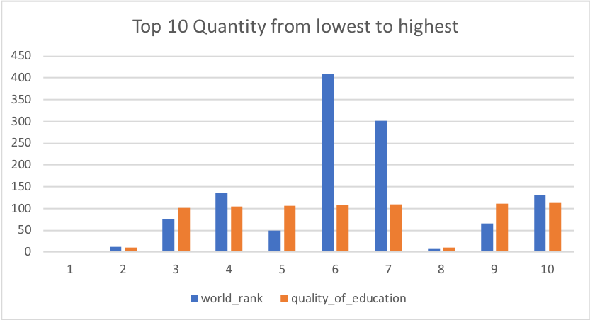

# Checkpoint2
1. -- Rank the quality_of_education from the lowest to highest in the US

```SQL
SELECT world_rank,quality_of_education
FROM datasets.world_college_ranking
WHERE location = 'USA'
ORDER BY quality_of_education ASC
```




2. -- Rank the world rank from the highest to lowest in UK

```SQL
SELECT world_rank, institution
FROM datasets.world_college_ranking
WHERE location = 'United Kingdom'
ORDER BY world_rank ASC
```

3. -- Rank the publications based on the score between 92.8 to 100

```SQL
SELECT publications,
count(score) as n_score
FROM datasets.world_college_ranking
WHERE score between '80' and '100'
GROUP BY publications
ORDER BY n_score DESC
```

4. -- What schools have citation between 100 to 300

```SQL
SELECT institution, world_rank,
    count(citations) as w_cit
FROM datasets.world_college_ranking
WHERE citations between '100' and '300'
GROUP BY institution, world_rank
ORDER BY institution DESC
```

5.-- In the US, what schools have alumi-employment between 270 to 600

```SQL
SELECT institution, location, alumni_employment
FROM datasets.world_college_ranking
Where location = 'USA' AND alumni_employment between '270' AND '600'
GROUP BY institution, location,alumni_employment
ORDER BY alumni_employment DESC
```

6. -- What schools have score below 60?

```SQL
SELECT institution, score
FROM datasets.world_college_ranking
WHERE score <= '60'
ORDER BY score DESC
```

7. -- What schools have broad_impact below 300?

```SQL
SELECT institution, broad_impact
FROM datasets.world_college_ranking
WHERE broad_impact <= '300'
ORDER BY broad_impact DESC
```

8. -- What is the total organized quality_of_faculty in South Korea

```SQL
SELECT institution, broad_impact, location
FROM datasets.world_college_ranking
WHERE location = 'South Korea'
ORDER BY quality_of_faculty
```

9. -- What is the influence rank for Japan

```SQL
SELECT institution, location, influence
FROM datasets.world_college_ranking
WHERE location = 'Japan' 
ORDER BY influence DESC
```

10. -- what colleges have national rank between 15 to 270 and quality of education between 150 to 400

```SQL
SELECT institution, national_rank, quality_of_education
FROM datasets.world_college_ranking
WHERE national_rank between '15' and '270' AND quality_of_education between '150' and '400'
ORDER BY national_rank, quality_of_education DESC
```
